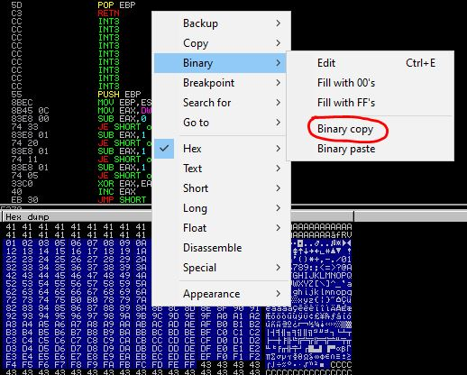

# bo_bad_char_finder
A script to find and verify bad chars whilst creating exploits for buffer overflows.

You're still going to have to most of the hardwork. 

However, this script helps you by
1. saving you the pain of finding the missing/replaced character
2. making sure you did'nt miss anything. 

## Requirements
Clone this repo
Python 3.8+ (i have used f strings)

## Usage
python3 badchars.py <inputFileName> [foundBadChars]

## Example with Immunity DBG
1.  Ofcourse, start with triggering a overflow with all chars int the buffer
2.  Copy the portion of the dump where the chars are (make sure you select the right starting point) (do a binary copy - select --> right click --> binary --> binary copy)

    

3.  Paste the contents into a file (you can name the file as chars)
4.  Run "python3 badchars.py chars"
5.  This might call out a single bad char. Else you are good to go.
6.  Say you got a bad char 0A in the previous step.  Remove that char from your buffer and trigger buffer overflow again. 
7.  Do steps 2 and 3 again
8.  Now when you call the script, do "python3 badchars.py chars 0A"
9.  Say now you found another bad char 0D. Remove that char from your buffer and trigger buffer overflow again. 
10. Do steps 2 and 3 again. Now when you call the script, do "python3 badchars.py chars 0A0D"
9.  Repeat till script says "All Good"

Im thinking similar instructions can be followed for other debuggers too. Feel free to Raise an issue / PR if additional support is needed.
